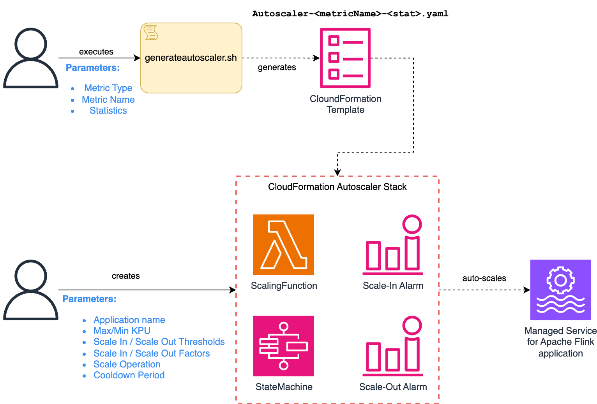

# Amazon Managed Service for Apache Flink - Custom autoscaler

This tool helps creating a custom autoscaler for your Amazon Managed Service for Apache Flink application.

The custom autoscaller allows you defining using metrics other than `containerCPUUtilization`, defining custom thresholds, max and min scale, and customize the autoscale cycle. 


Setting up the autoscaler is a two-steps process:
1. Generate a CloudFormation (CFN) template for an autoscaler for on a specific metric and statistic
2. Use the generated CFN template to deploy a CFN Stack which control autoscaling of a specific Managed Service for Apache Flink application.


## Process overview


1. Decide metric and statistic for your autoscaler (see [Supported metric](#supported-metrics)).
2. Run the `generateautoscaler.sh` script to generate the CFN template. The generate template is named `Autoscaler-*.yaml` (see [Generate CFN template](#generate-the-cloudformation-template-using-the-script-recommended))
3. Use the CFN template to create the autoscaler Stack. When you create the stack specify all remaining [autoscaler parameters](#autoscaler-parameters), including the application name (see [Deploying the autoscaler template](#deploying-the-autoscaler-template))


Notes 
* A generated CFN Template hardwires a specific metric and statistics.
* An autoscaler Stack controls a single Managed Flink application.
* If you want to create autoscaler Stacks for multiple applications, using the same metric and statistics, you can reuse the same CFN Template.

The CFN Stack creates two CloudWatch Alarms, a StepFunction and a Lambda function which automatically control the scaling of your Managed Flink application.





> ⚠️ Neither the autoscaler nor CloudWatch Alarm validate the metric name. 
> If you type a wrong metric name or select a metric type inconsistent with the metric, the CFN template will create the autoscaler stack but the CloudWatch Alarms controlling the scale will never trigger.  


---

## Step 1: Generate the CloudFormation template using the script (recommended)

1. Ensure you have installed AWS CDK in the current directory: `npm install aws-cdk-lib` 
2. Decide which metric and statistics you want to use. See [Supported metrics](#supported-metrics) and [Supported statistics](#supported-statistics)
3. Execute the generator script to generate the YAML file with the CloudFormation template

```
generateautoscaler.sh type=<metric-type metric=<metric-name> stat=<statistics> 
```

The script generates a CFN template file named `Autoscaler-<metric>-<statistic>.yaml` in the same directory.

Script parameters:
* `type` [`KinesisAnalytics`, `MSK`, `Kinesis`, `KinesisEFO`]: determines the metric type (default: `KinesisAnalytics`).
* `metric`: (mandatory) name of the metric. See [Supported metric](#supported-metrics).
* `stat` [`Average`, `Minimum`, `Maximum`, `Sum`] : metric statistics (default: `Maximum`). See [Supported statistics](#supported-statistics).


Examples of valid generator commands:

```
./generateautoscaler.sh type=KinesisAnalytics metric=containerCPUUtilization stat=Average

./generateautoscaler.sh type=MSK metric=MaxOffsetLag stat=Maximum

./generateautoscaler.sh type=Kinesis metric=GetRecords.IteratorAgeMilliseconds stat=Maximum

./generateautoscaler.sh type=KinesisEFO metric=SubscribeToShardEvent.MillisBehindLates stat=Maximum
```

### Supported metrics

When you generate the CFN template you specify
1. Metric type (see below)
2. Metric name
3. Statistic (Maximum, Average etc)

The metric type determines the Namespace and Dimensions of the CloudWatch metric to use for autoscaling.

> The name *KinesisAnalytics* refers to metrics exposed by Amazon Managed Service for Apache Flink. This is due to the CloudWatch Namespace that is called `AWS/KinesisAnalytics` for legacy reasons. 


| Metric Type  | Supported Metrics                                                                                                                                                                              | Namespace              | Dimensions                                |
|--------------|------------------------------------------------------------------------------------------------------------------------------------------------------------------------------------------------|------------------------|-------------------------------------------|
| `KinesisAnalytics`        | Any metrics exposed by Managed Service for Apache Flink which have only the `Applicaton` dimension. This also includes custom metrics when *Monitoring metrics level* is set to *Application*. | `AWS/KinesisAnalytics` | `Application`                             |
| `MSK`        | MSK Consumer Group metrics, such as `EstimatedMaxTimeLag`, `EstimatedTimeLag`, `MaxOffsetLag`, `OffsetLag`, and `SumOffsetLag`.                                                                | `AWS/Kafka`            | `Cluster Name`, `Consumer Group`, `Topic` |
| `Kinesis`    | Any basic stream-level metrics exposed by Kinesis Data Streams with `StreamName` dimension only (i.e. excluding metric related to EFO consumers.                                               | `AWS/Kinesis`          | `StreamName`                              |
| `KinesisEFO` | Any basic stream-level metrics exposed by Kinesis Data Streams for EFO consumers, with `StreamName` and `ConsumerName` dimensions. For example `SubscribeToShardEvent.MillisBehindLatest`.     | `AWS/Kinesis`          | `StreamName`,  `ConsumerName`             |

Reference docs
* [Metrics and dimensions in Managed Service for Apache Flink](https://docs.aws.amazon.com/managed-flink/latest/java/metrics-dimensions.html)
* [Use custom metrics with Amazon Managed Service for Apache Flink](https://docs.aws.amazon.com/managed-flink/latest/java/monitoring-metrics-custom.html)
* MSK: [Monitoring consumer lags](https://docs.aws.amazon.com/msk/latest/developerguide/consumer-lag.html)
* [Monitor the Amazon Kinesis Data Streams service with Amazon CloudWatch](https://docs.aws.amazon.com/streams/latest/dev/monitoring-with-cloudwatch.html#kinesis-metrics-stream)


### Supported statistics

The autoscaler supports the following metric statistics:
* `Average`
* `Maximum`
* `Minumum`
* `Sum`

The period of calculation of the statistic is defined when you create the stack (default: 60 sec).

### Requirements for template generation

To generate the CFN template you need:
1. AWS CLI
2. AWS CDK (Node.js). See [Getting started with AWS CDK](https://docs.aws.amazon.com/cdk/v2/guide/getting_started.html).

This code has been tested with the following versions:
* Node v22.15.0
* aws-cdk@2.1001.0
* aws-cdk-lib@2.181.1 (constructs@10.4.2)
* aws-cli 2.24.14

The script will install any required Node dependency in the `./cdk` directory, using `npm install`.

--- 

## Step 2: Deploying the autoscaler template 

You can use the generated autocaler CFN template to create an autoscaler stack that uses the metric and stats you specified when you generated the script, with any Managed Flink application.

To deploy it (to create the stack) you can either use the AWS console or [CloudFormation CLI](https://awscli.amazonaws.com/v2/documentation/api/latest/reference/cloudformation/create-stack.html).

> ⚠️ The provided CDK code is not designed to deploy the autoscaler stack. It only generates the CFN YAML template, locally.


When you deploy the CFN Template you need to specify additional parameters, to specify the application to control and other variables of the autoscaler, such as thesholds and scaling factors. The parameters depends on the metric type you chose, when you generated the template.

### Paramers requested for all metric types

Paramters you probably want to customize, for each application:

| Parameter       | Parameter name | Default | Description  |
|-----------------|----------------|---------|--------------|
| Application Name  | `ApplicationName` | (none) | Name of the Managed Flink application to control. |
| Maximum KPU | `MaxKPU` | 10 | Maximum number of KPU the autoscaler may scale out to. |
| Minimum KPU | `MinKPU` | 1  | Minimum number of KPU the autoscaler may scale in to. |
| Scale operation | `ScaleOperation` | (none)  | Operation to calculate the new parallelism, when scaling out/in. `Multiply/Divide` to multiply or divide the current parallelism by the scaling factor, `Add/Subtract` to add to or substract from the current parallelism. |
| Scale-out factor  | `ScaleOutFactor` | 2  | Factor added to (Add) or multiplied by (Multiply) the current parallelism, on a scale-out event. |
| Scale-out metric threshold | `ScaleOutThreshold`  | 80 | Upper threshold for the metric to trigger the scaling-out alarm. |
| Scale-in factor | `ScaleInFactor` | 2  | Factor subtracted to (Subtract) or divided by (Divide) the current parallelism, on a scale-in event. |
| Scale-in metric threshold  | `ScaleInThreshold` | 20 | Lower threshold for the metric to trigger the scaling-in alarm.  |
| Cooling down period (grace period) after scaling | `ScalingCoolingDownPeriod` | 300 (seconds) | Cool-down time, after the application has scaled in or out, before reconsidering the scaling alarm. |
| Scaling Alarm evaluation datapoints | `ScalingEvaluationPeriod` | 5 | Number of datapoints (metric periods) considered to evaluate the scaling alarm. This is in terms of datapoints. The actual duration depends on the metric period. |
| Number of datapoints to trigger the alarm | `DataPointsToTriggerAlarm` | 5 | Number of datapoints (metric periods) beyond threshold that trigger the scaling alarm. |

Notes
* *Cooling down period (grace period) after scaling* should be long enough to let the application stabilize after scaling in or out.
  If the grace period is too short (and the scaling factor is too small), the backlog accumulated in the downtime while
  the application is scaling may cause consecutive "bounce up" when the application scales up on a workload peal, 
   or "bouncing down and up" when the application scales down
* If you choose *Scale operation* = *Add/Subtract* and you are too conservative in the Scale-in or Scale-out factors,
  the autoscaler may trigger many consecutive scaling events increasing the overall downtime.


Parameters you seldom want to change:

| Parameter       | Parameter name | Default | Description  |
|-----------------|----------------|---------|--------------|
| Waiting time while updating | `UpdateApplicationWaitingTime` | 60 (seconds) | This is the polling interval during the scaling operation, to check whether the application is still in `UPDATING` state. We recommend not to change this unless your application takes very long time to scale, due to a very big state. |
| Metric data point duration (metric period) | `MetricPeriod` | 60 (seconds) | Duration of each individual metric datapoints stats used for the alarm. This is the period over which the statistics is calculated. You probably do not want to change the default 60 seconds. | 


### Parameters requested for `MSK` metric type only

These parameters are requested only if you selected metric type `MSK` at template generation.

| Parameter       | Parameter name | Default | Description  |
|-----------------|----------------|---------|--------------|
| MSK cluster name | `MSKClusterName`| (none)  | Name of the MSK cluster.  |
| Kafka Consumer Group name | `KafkaConsumerGroupName` | (none)  | Name of the Kafka Consumer Group. |
| Kafka topic name | `KafkaTopicName` | none)  | Name of the topic. |

### Parameters requested for `Kinesis` and `KinesisEFO` metric types only

These parameters are requested only if you selected metric type `Kinesis` or `KinesisEFO` at template generation.

| Parameter       | Parameter name | Metric type | Default | Description  |
|-----------------|----------------|-------------|---------|--------------|
| Kinesis Data Stream name | `KinesisDataStreamName` | `Kinesis` and `KinesisEFO` | (none)  | Name of the Kinesis stream. |
| Kinesis EFO Consumer name | `KinesisConsumerName` | `KinesisEFO` | (none)  | Consumer Name, for metrics like `SubscribeToShardEvent.MillisBehindLatest`. |


--- 

## Known limitation

The autoscaler only supports for Managed Service for Apache Flink metrics with `Application` dimension.

If your application uses *Monitoring metrics level* = *Application* all metrics are published to CloudWatch with `Application` 
dimension only, and the autoscaler can use any metrics.
However, when *Monitoring metrics level* is set to higher than *Application*, the autoscaler can only use metrics exposed 
at Application level, such as `containerCPUUtilization`, `containerMemoryUtilization`, or `heapMemoryUtilization`.

When *Monitoring metrics level* is set to higher than *Application*, [custom metrics]((https://docs.aws.amazon.com/managed-flink/latest/java/monitoring-metrics-custom.html)) 
are also published to CloudWatch with additional dimensions and cannot be used by the autoscaler.

The autoscaler does not support defining autoscaling based on math expression. Only simple statistics are supported.
