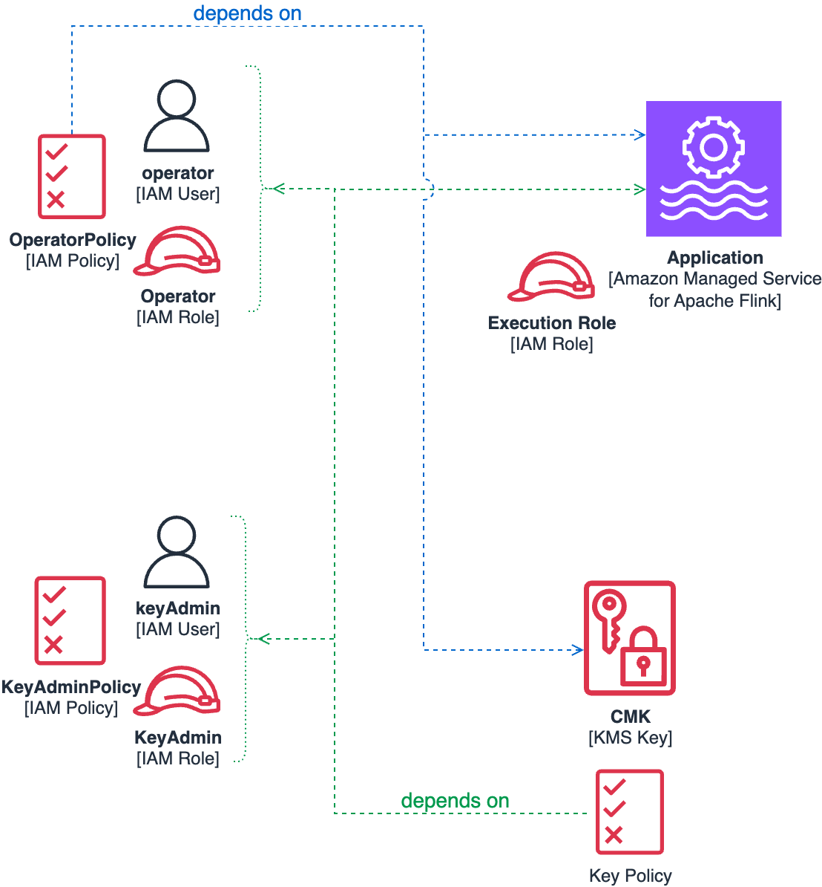

## Customer Managed Key (CMK) support

This folder contains some CloudFormation templates to help creating the IAM Policies and KMS Keys to enable CMK in an 
Amazon Managed Service for Apache Flink application.

**Important**: Setting up CMK following the Principle of least privilege requires setting up at least two IAM Users or Roles, 
and execute a number of steps, [described below](#setting-up-cmk-on-an-application), in order and with different users. 
This process cannot be automated using a simple CFN template. 
The provided CFN templates help creating the required IAM Policies and KMS Key with correct policy. The full process 
requires some additional steps which can be done manually, using the AWS CLI/API, the Console, or any automation tool


For further information see the service documentatio: [Key Management in Amazon Managed Service for Apache Flink](https://docs.aws.amazon.com/managed-flink/latest/java/key-management-flink.html).

### Background

#### Actors

To use CMK following the Principle of least privilege, implies multiple and separate actors:

1. The KMS **Customer Managed Key** (CMK), which comprises a Key Policy and the actual Key Material used for encryption.
2. A **Key Administrator** IAM Role or User, who creates and manages the CMK.
3. An **Operator** IAM Role or User, who uses the Managed Flink API (`kinesisanalyticsv2`) to control the lifecycle of the application, including configuring it and enabling CMK. 
4. The Managed Flink **Application** itself, which has a IAM Service Role attached to control the permission of the application. 


#### Dependencies between components

Some of these components refer to other components, causing dependencies:

* The *Operator* IAM Policy contains a reference to the *Application* and the *CMK* ARNs.
* The *CMK Key Policy* contains a reference to the *Operator* User or Role, the *Key Administrator* User or Role, and the *Application* ARN.



Because of these dependencies, setting up CMK for an application must be done in a precise order, as described in the following section.


### Setting up CMK on an application

1. Create the *Operator's Base IAM Policy* using the [msf-cmk-operator-iam-policy.yaml](msf-base-operator-iam-policy.yaml) CFN template. 
2. Attach the Base Policy to the Operator's User or Role.
3. If the application doesn't exist yet, use Operator's credentials to create an application, _without_ CMK.
4. Create the *Key Administrator's IAM Policy* using [msf-key-administrator-policy.yaml](kms-key-administrator-policy.yaml). 
5. Attach the Policy to the IAM User/Role you are going to use to manage the CMK key. 
6. Use the Key Administrator's credentials to create the CMK, using [msf-kms-key.yaml](msf-kms-key.yaml). The template will ask you to provide the application name, the Operator's Role/User, and the Key Administrator's Role/User ARNs.
7. Create the *Operator's CMK IAM Policy* using [msf-cmk-operator-iam-policy.yaml](msf-cmk-operator-iam-policy.yaml). 
8. Attach the new policy to the Operator's User/Role, without removing the Base policy. The template will ask to provide the application name and the CMK ID.
9. Use the Operator's credentials to update the application, enabling CMK with the key you created at step (6)

> Note 1: No CFN template is provided for steps (2), (3), (4), (7), and (8). These steps depend on your setup and whether you are using IAM Users or Roles as Operator and Key Administrator. You can use the AWS CLI, the Console, or any automation tool for these steps.  
> Refer to *Using Customer Managed Key in Amazon Managed Service for Apache Flink*[**TODO link**] service documentation page for setting CMK on an existing application.

> Note 2: the *Operator's Base IAM Policy* defined by [msf-base-operator-iam-policy.yaml](msf-base-operator-iam-policy.yaml) gives the Operator broad permissions to control any application in the account and attach any service role to the application. You can restrict this policy with further conditions as required.


### Testing CMK

Setting up CMK following the Principle of least privilege, as described above, makes it hard to simply test CMK where more lenient security policies can be applied, like in non production environment. 
If you want to use CMK with a single user having broad permissions acting both as *Operator* and *Key Administrator*, you can apply the following Key Policy when you create the CMK Key.


```JSON
{
    "Version": "2012-10-17",
    "Id": "key-policy-permissive",
    "Statement": [
        {
            "Sid": "Allow any KMS action to Admin",
            "Effect": "Allow",
            "Principal": {
                "AWS": "arn:aws:iam::<account-id>:role/Admin"
            },
            "Action": "kms:*",
            "Resource": "*"
        },
        {
            "Sid": "Allow any KMS action to Managed Flink",
            "Effect": "Allow",
            "Principal": { 
                "Service": [
                  "kinesisanalytics.amazonaws.com",
                  "infrastructure.kinesisanalytics.amazonaws.com"
                ]
            },
            "Action": "kms:*",
            "Resource": "*"
        }
    ]
} 

```

⚠️ This key policy should not be used in production environments or environments containing sensitive data 
