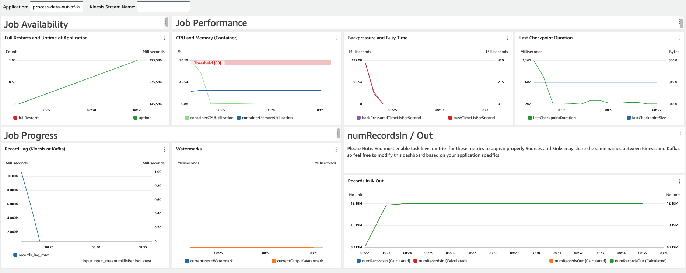

## Managed Service for Apache Flink Metrics Dashboard - CloudFormation Template

This repository contains a CloudFormation template that you can customize to deploy a sample metrics dashboard for your [Managed Service for Apache Flink](https://docs.aws.amazon.com/kinesisanalytics/latest/java/what-is.html) application.

Here's a screenshot of the dashboard:

Before you deploy the template, please make sure that you enter appropriate values for these parameters:

- ApplicationName: The Managed Service for Apache Flink app to monitor
- MSFRegion: The region where the Managed Service for Apache Flink app is deployed
- KinesisStreamName (optional): The Kinesis stream name which is configured as input in Kinesis Analytics application (assuming you're reading from a Kinesis stream)
- DashboardName: The name you'd like to assign to the newly created CloudWatch Dashboard

#### It should be noted that this dashboard supports both Apache Kafka and Amazon Kinesis Data Streams as sources, so long as the application has a single source.

## Security

See [CONTRIBUTING](CONTRIBUTING.md#security-issue-notifications) for more information.

## License

This sample is licensed under the MIT-0 License. See the LICENSE file.

