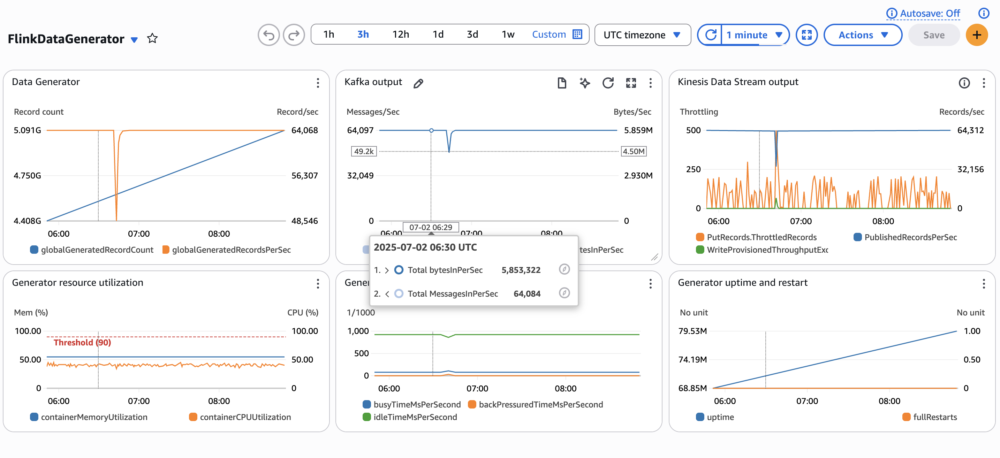

# Flink JSON Data Generator to Kinesis or Kafka

This example demonstrates how you can use Apache Flink's as a data generator for load testing.

* Flink version: 1.20
* Flink API: DataStream API
* Language: Java (11)
* Flink connectors: DataGen, Kafka Sink, Kinesis Sink

The application generates random stock prices at fixed rate. 
Depending on runtime configuration it will send generated records, as JSON, either to a Kinesis Data Stream 
or an MSK/Kafka topic (or both).

The application can easily scale to generate high throughput. For example, with 3 KPU you can generate more than 64,000 records per second.
See [Using the data generator for load testing](#using-the-data-generator-for-load-testing).

It can be easily modified to generate different type of records, changing the implementation of the record class 
[StockPrice](src/main/java/com/amazonaws/services/msf/domain/StockPrice.java), and the function generating data [StockPriceGeneratorFunction](src/main/java/com/amazonaws/services/msf/domain/StockPriceGeneratorFunction.java)

### Prerequisites

The data generator application must be able to write to the Kinesis Stream or the Kafka topic
* Kafka/MSK
  * The Managed Flink application must have VPC networking. 
  * Routing and Security must allow the application to reach the Kafka cluster.
  * Any Kafka/MSK authentication must be added to the application (this application writes unauthenticated)
  * Kafka ACL or IAM must allow the application writing to the topic
* Kinesis Data Stream
  * The Managed Flink application IAM Role must have permissions to write to the stream
  * Ensure the Kinesis Stream has sufficient capacity for the generated throughput
  * If the application has VPC networking, you must also create a VPC Endpoint for Kinesis to be able to write to the Stream
  


### Runtime configuration

The application reads the runtime configuration from the Runtime Properties, when running on Amazon Managed Service for Apache Flink,
or, when running locally, from the [`src/main/resources/flink-application-properties-dev.json`](src/main/resources/flink-application-properties-dev.json) file.
All parameters are case-sensitive.

The presence of the configuration group `KafkaSink` enables the Kafka sink. 
Likewise, `KinesisSink` enables the Kinesis sink.


| Group ID      | Key                   | Description                                                                                                                                                                                                                                     | 
|---------------|-----------------------|-------------------------------------------------------------------------------------------------------------------------------------------------------------------------------------------------------------------------------------------------|
| `DataGen`     | `records.per.second`  | Number of records per second generated across all subtasks.                                                                                                                                                                                     |
| `KinesisSink` | `stream.arn`          | ARN of the Kinesis Stream                                                                                                                                                                                                                       |
| `KinesisSink` | `aws.region`          | Region of the Kinesis Stream                                                                                                                                                                                                                    |
| `KinesisSink` | (any other parameter) | Any other parameters in this group is passed to the Kinesis sink connector as KinesisClientProperties. See [documentation](https://nightlies.apache.org/flink/flink-docs-release-1.20/docs/connectors/datastream/kinesis/#kinesis-streams-sink) |
| `KafkaSink`   | `bootstrap.servers`   | Kafka bootstrap servers.                                                                                                                                                                                                                        | 
| `KafkaSink`   | `topic`               | Name of the Kafka topic.                                                                                                                                                                                                                        |
| `KafkaSink`   | (any other parameter) | Any other parameters in this group is passed to the Kafka sink connector as KafkaProducerConfig. See [documentation](https://nightlies.apache.org/flink/flink-docs-release-1.20/docs/connectors/datastream/kafka/#kafka-sink)                   |                                                                                                                                                                                           


> Renaming `KafkaSink` or `KinesisSink` groups to something different, for example `KinesisSink-DISABLE` prevents
> the generator creating that particular sink.

### Running in IntelliJ

You can run this example directly in IntelliJ, without any local Flink cluster or local Flink installation.

See [Running examples locally](../running-examples-locally.md) for details.

---

## Data Generation

This example generates random stock price records similar to the following:

```json
{
  "event_time": "2024-01-15T10:30:45.123",
  "ticker": "AAPL",
  "price": 150.25
}
```

The data generation can be easily customized to match your specific records, modifying two components:

* The class [StockPrice](src/main/java/com/amazonaws/services/msf/domain/StockPrice.java) representing the record.
  You can use [Jackson annotations](https://github.com/FasterXML/jackson-annotations/wiki/Jackson-Annotations) to customize the generated JSON.
* The class [StockPriceGeneratorFunction](src/main/java/com/amazonaws/services/msf/domain/StockPriceGeneratorFunction.java)
  contains the logic for generating each record.

### Partitioning

Records published in Kinesis or Kafka are partitioned by the `ticker` field.

If you customize the data object you also need to modify the `PartitionKeyGenerator<T>` and `SerializationSchema<T>`
extracting the key in the Kinesis and Kafka sink respectively.

## Using the data generator for load testing

This application can be used to load test other applications.

Make sure the data generator application has sufficient resources to generate the desired throughput.

Also, make sure the Kafka/MSK cluster or the Kinesis Stream have sufficient capacity to ingest the generated throughput.

⚠️ If the destination system or the data generator Flink application are underprovisioned, you may generate a throughput lower than expected.

For reference, the following configuration allows generating ~64,000 records/sec to either Kinesis or Kafka:
* `Parallelism = 3`, `Parallelism-per-KPU = 1` (`3 KPU`)
* `DataGen` `records.per.second` = `64000`

> We recommend to overprovision the data generator to ensure the required throughput can be achieved. 
> Use the provided [CloudWatch dashboard](#cloudwatch-dashboard) to monitor the generator.

### Monitoring the data generator

The application exposes 3 custom metrics to CloudWatch:
* `generatedRecordCount`: count of generated record, per parallelism
* `generatedRecordRatePerParallelism`: generated records per second, per parallelism
* `taskParallelism`: parallelism of the data generator

> ⚠️ Flink custom metrics are not global. Each subtask maintains its own metrics.
> Also, for each metric Amazon Managed Service for Apache Flink exports to CloudWatch 4 datapoints per minute, per subtask.
> That considered, to calculate the total generated record and rate, across the entire application, you need to apply 
> the following maths:
> - Total generatedRecordCount = `SUM(generatedRecordCount) / 4`, over 1 minute
> - Total generatedRecordsPerSec = `AVG(generatedRecordRatePerParallelism) * AVG(taskParallelism)`, over 1 minute

#### CloudWatch Dashboard

The CloudFormation template [dashboard-cfn.yaml](tools/dashboard-cfn.yaml) provided can be used to create a CloudWatch Dashboard
to monitor the data generator

.

When creating the CloudFormation stack you need to provide:
* The name of the Managed Flink application
* The Region
* The name of the Kinesis Stream, if publishing to Kinesis
* The name of the MSK cluster and topic, if publishing to MSK

> Note: the dashboard assumes an MSK cluster with up to 6 brokers. 
> If you have a cluster with more than 6 brokers you need to adjust the *Kafka output* widget

### Known limitations and possible extensions

* Only JSON serialization is supported.
* Data generation is stateless. The logic generating each record does not know about other records previously generated.
* Fixed record rate only. No ramp up or ramp down.
