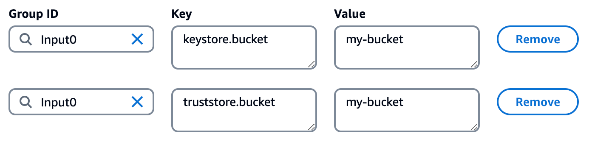

## Troubleshooting common problems

Few important points to consider that will help troubleshoot or prevent any potential issues or errors while running the Flink application.

1. When packaging the Flink application and its dependencies into a Jar file that can be deployed to the Flink environment, make sure that the following dependency is added in pom.xml for the `KafkaCustomKeystoreWithConfigProviders` Java project. Not having this dependency will result in a `ClassNotFoundException` (for any class e.g. `SecretsManagerConfigProvider` that is referenced from the package `com.amazonaws.kafka.config.providers`).  

   ```
   <dependency>
     <groupId>com.amazonaws</groupId>
     <artifactId>msk-config-providers</artifactId>
     <version>0.0.1-SNAPSHOT-uber</version>
   </dependency>
   ```

2. While configuring Managed Apache Flink application, please ensure that the VPC connectivity, Subnets and Security Groups (under ‘Networking’ section) are correctly selected and are allowing access to the required resources, e.g. Kafka cluster and brokers. Depending on the setup e.g. for mTLS you may need to add a self-reference inbound rule to the security group for port 9094. Also, check if there are any Kafka ACLs set on the respective topic(s) for authorization and if the required operation(s) have the `ALLOW` permissionType.  

3. While configuring the Runtime properties for the Apache Flink application, please ensure that the values for `keystore.bucket` and `truststore.bucket` do not contain the prefix `s3://` . This is different from `Application code location` section where the specified Amazon S3 bucket needs to have the format `s3://bucket`.Also, the path to S3 object(s) e.g. `keystore.path` doesn't need a trailing slash. For e.g., if the keystore `kafka.client.keystore.jks` is stored within the S3 bucket `my-bucket`, then the runtime properties can be as follows:

    

4. When running the Apache Flink application, if you are getting a `SecretsManagerException` with Status Code 400 (e.g. not authorized to perform: `secretsmanager:GetSecretValue` on resource: SSL_KEYSTORE_PASS because no identity-based policy allows the `secretsmanager:GetSecretValue` action), please make sure that the IAM Role for the application has the necessary permission policy for SecretsManager.
