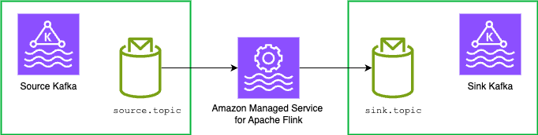

# Flink Kafka Source & Sink Examples

* Flink version: 1.20
* Flink API: DataStream API
* Language: Java (11)

This example demonstrate how to use
[Flink Kafka Connector](https://nightlies.apache.org/flink/flink-docs-release-1.18/docs/connectors/datastream/kafka/),
source and sink.

This example uses KafkaSource and KafkaSink.

,

> In this example, the Kafka Sink uses *exactly-once* delivery guarantees. This leverages Kafka transaction under the hood, improving guarantees but 
> adding some overhead and increasing the effective latency of the output to the consumers of the destination Kafka topic. 
> 
> Moreover, there are failure scenarios were the Kafka Sink may still cause duplicates, even when set for exactly-once guarantees.
> See [FLIP-319](https://cwiki.apache.org/confluence/pages/viewpage.action?pageId=255071710) for more details.
>
> We recommend not to consider Kafka Sink *exactly-once* guarantees as a default setting for all sinks to Kafka. 
> Make sure you understand the implications before enabling it. Refer to the [Flink Kafka sink documentation](https://nightlies.apache.org/flink/flink-docs-release-1.19/docs/connectors/datastream/kafka/#fault-tolerance) for details.

Note that the old 
[`FlinkKafkaConsumer`](https://nightlies.apache.org/flink/flink-docs-release-1.18/docs/connectors/datastream/kafka/#kafka-sourcefunction)
and [`FlinkKafkaProducer`](https://nightlies.apache.org/flink/flink-docs-release-1.18/docs/connectors/datastream/kafka/#kafka-producer)
were removed in Flink 1.17 and 1.15, respectively.

## Runtime configuration

When running on Amazon Managed Service for Apache Flink the runtime configuration is read from *Runtime Properties*.

When running locally, the configuration is read from the [`resources/flink-application-properties-dev.json`](resources/flink-application-properties-dev.json) file located in the resources folder.

Runtime parameters:

| Group ID  | Key                 | Description                       | 
|-----------|---------------------|-----------------------------------|
| `Input0`  | `bootstrap.servers` | Source cluster boostrap servers.  |
| `Input0`  | `topic`             | Source topic (default: `source`). |
| `Input0`  | `group.id`          | Source group id (default: `my-group`) |
| `Output0` | `bootstrap.servers` | Destination cluster bootstrap servers. |
| `Output0` | `topic`             | Destination topic (default: `destination`). |
| `Output0` | `transaction.timeout.ms` | Sink transaction timeout (default: `1000`) |

If you are connecting with no-auth and no SSL, above will work. Else you need additional configuration for both source and sink.

### For IAM Auth

When using IAM Auth, the following Runtime Properties are expected at the Group ID `AuthProperties`:
* `sasl.mechanism` AWS_MSK_IAM
* `sasl.client.callback.handler.class` software.amazon.msk.auth.iam.IAMClientCallbackHandler
* `sasl.jaas.config` "software.amazon.msk.auth.iam.IAMLoginModule required;"
* `security.protocol` SASL_SSL
* `ssl.truststore.location` /usr/lib/jvm/java-11-amazon-corretto/lib/security/cacerts
* `ssl.truststore.password` changeit

## Running locally in IntelliJ

> Due to MSK VPC networking, to run this example on your machine you need to set up network connectivity to the VPC where MSK is deployed, for example with a VPN.
> Alternatively, you can use a local Kafka installation, for example in a container.
> Setting up the connectivity or a local containerized Kafka depends on your set up and is out of scope for this example.

You can run this example directly in IntelliJ, without any local Flink cluster or local Flink installation.

See [Running examples locally](../running-examples-locally.md) for details.
