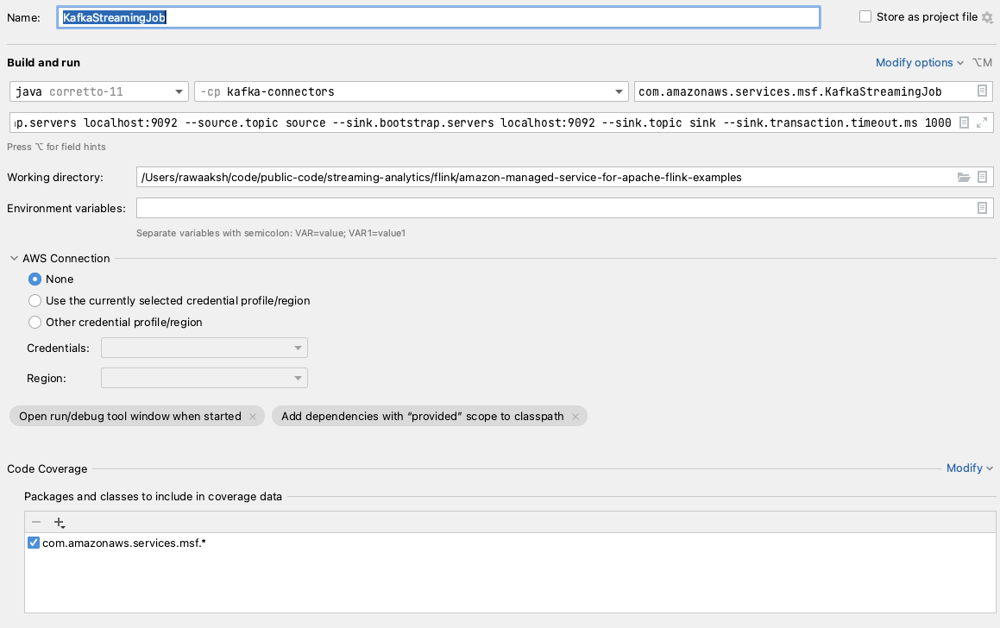

# Flink Kafka Source & Sink Examples

* Flink version: 1.18
* Flink API: DataStream API
* Language: Java (11)


This example demonstrate how to use
[Flink Kafka Connector](https://nightlies.apache.org/flink/flink-docs-release-1.18/docs/connectors/datastream/kafka/),
source and sink.

This example uses `KafkaSource` and `KafkaSink`.

,

Note that the old 
[`FlinkKafkaConsumer`](https://nightlies.apache.org/flink/flink-docs-release-1.18/docs/connectors/datastream/kafka/#kafka-sourcefunction)
and [`FlinkKafkaProducer`](https://nightlies.apache.org/flink/flink-docs-release-1.18/docs/connectors/datastream/kafka/#kafka-producer)
were removed in Flink 1.17 and 1.15, respectively.

## Runtime configuration

The application reads the runtime configuration from the Runtime Properties, when running on Amazon Managed Service for Apache Flink,
or from command line parameters, when running locally.

Runtime Properties are expected in the Group ID `FlinkApplicationProperties`.
Command line parameters should be prepended by `--`.

They are all case-sensitive.

Configuration parameters:

* `source.bootstrap.servers` source cluster boostrap servers
* `source.topic` source topic (default: `source`)
* `sink.bootstrap.servers` sink cluster bootstrap servers
* `sink.topic` sink topic (default: `destination`)
* `sink.transaction.timeout.ms` Sink transaction timeout 

If you are connecting with no-auth and no SSL, above will work. Else you need additional configuration for both source and sink.
### For IAM Auth


* `source.sasl.mechanism` AWS_MSK_IAM
* `source.sasl.client.callback.handler.class` software.amazon.msk.auth.iam.IAMClientCallbackHandler
* `source.sasl.jaas.config` "software.amazon.msk.auth.iam.IAMLoginModule required;"
* `source.security.protocol` SASL_SSL
* `source.ssl.truststore.location` /usr/lib/jvm/java-11-amazon-corretto/lib/security/cacerts
* `source.ssl.truststore.password` changeit
* `sink.sasl.mechanism` AWS_MSK_IAM
* `sink.sasl.client.callback.handler.class` software.amazon.msk.auth.iam.IAMClientCallbackHandler
* `sink.sasl.jaas.config` "software.amazon.msk.auth.iam.IAMLoginModule required;"
* `sink.security.protocol` SASL_SSL
* `sink.ssl.truststore.location` /usr/lib/jvm/java-11-amazon-corretto/lib/security/cacerts
* `sink.ssl.truststore.password` changeit


## Running locally in IntelliJ

To run this example locally - 
* Run a Kafka cluster locally. You can refer https://kafka.apache.org/quickstart to download and start Kafka locally.
* Create `source` and `sink` topics. 
* To start the Flink job in IntelliJ edit the Run/Debug configuration enabling *'Add dependencies with "provided" scope to the classpath'*.

Provide arguments like following -
```
--source.bootstrap.servers localhost:9092 --source.topic source --sink.bootstrap.servers localhost:9092 --sink.topic sink --sink.transaction.timeout.ms 1000
```

Following is the screenshot of run configuration

