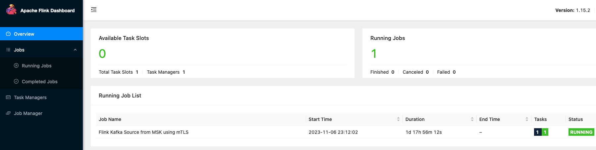

## Running Apache Flink application on Amazon Managed Service for Apache Flink with Kafka source (Amazon MSK) using mTLS authentication

> For troubleshooting common issues, refer to the [troubleshooting guide](troubleshoot-guide.md) in this repo.

This example describes the steps performed to configure and run an Apache Flink application on Amazon Managed Service for Apache Flink, with Amazon Managed Streaming for Apache Kafka (Amazon MSK) as the source, using TLS mutual authentication.

### 1. Create and configure the Amazon MSK Cluster

Configure the Amazon MSK cluster to be deployed into a VPC, with brokers deployed in 3 private subnets (one per AZ). The other settings shown on the AWS Console can be left as default in this case.

Under `Security settings → Access control methods` select the option `TLS client authentication through AWS Certificate Manager (ACM)`. Next select an AWS Private CA (will be needed to authenticate the identity of clients connecting to MSK cluster over TLS).

Under `Security settings → Encryption` select `TLS encryption` option for `Between clients and brokers` as well as `Within the cluster` . We’ll be using AWS Managed key to encrypt data at rest.

Now 2 Security Groups will be needed for this exercise: 

1. one Security Group associated with the producer (we’ll use Kafka Client on EC2), consumer(s), and admin hosts;
2. another Security Group to attach to the Amazon MSK cluster that references the first.

Create the Security Group for the Amazon MSK cluster. Add Inbound rules for TLS access (port 9094), and ZooKeeper access (port 2181) if your cluster uses it. 
Also add a self-reference inbound rule to the Security Group for port 9094, that will be used to allow access to Managed Service for Apache Flink.

### 2. Setup client bastion

We can use the AWS Cloud9 environment and `KafkaClientEC2Instance` setup as described in the [MSK Labs Workshop](https://catalog.workshops.aws/msk-labs/en-US/overview/setup) for testing.

SSH into `KafkaClientEC2Instance` from Cloud9 terminal.

Export the brokers and zookeeper connection strings for the Amazon MSK cluster-
```
export brokers = $(aws kafka get-bootstrap-brokers --cluster-arn <enter cluster ARN> --output text)`

export zkeeper=$(aws kafka describe-cluster --cluster-arn <enter cluster ARN> --output json | jq ".ClusterInfo.ZookeeperConnectString" | tr -d \")
```

### 3. Create a Kafka topic and send messages to the topic

We can use `kafka-topics` utility to create a new topic-
```
/home/ec2-user/kafka/bin/kafka-topics.sh --bootstrap-server $brokers --create --topic <enter topicName> --partitions <enter no of partitions> --replication-factor <enter rf value>
```

Now we'll start a Producer to send messages to this topic. You can use either of the two utilities mentioned below to send messages to the topic:

#### (a) Kafka Console Producer

```
cd /home/ec2-user/kafka
bin/kafka-console-producer.sh --broker-list $brokers --topic <topicName>
```

#### (b) Java ClickStream Producer

Go to `/tmp/kafka` directory and update the `.properties` files

```
cd /tmp/kafka
rm producer.properties_msk
cat <<EOF > producer.properties_msk
BOOTSTRAP_SERVERS_CONFIG=$brokers
SSL_KEYSTORE_PASSWORD_CONFIG=<password>
SSL_KEY_PASSWORD_CONFIG=<password>
EOF
```
Run the producer
```
export region = us-east-1

java -jar KafkaClickstreamClient-1.0-SNAPSHOT.jar -t <topic name> -pfp /tmp/kafka/producer.properties_msk -nt 8 -rf 60 -mtls -gsr -gsrr $region -gar -gcs FULL -reg $region
```

### 4. Setup Keystore and Truststore

Note the ARN of private CA associated with the MSK cluster above. Next, run the following command to- 
- Generate a Private Key.
- Create a Java Keystore with the password provided for Keystore.
- Store the Private Key in the keystore with the password provided for Keystore.
- Convert the Private Key to PEM and store it in a pem file at /tmp/private_key.pem.
- Generate a CSR (Certificate Signing Request) for the Private Key.
- Connect to the ACM PCA provided and get a certificate issued from the CSR.
- Connect to the ACM PCA provided and get the issued certificate.
- Store the issued certificate in the Java Keystore.
- Convert the issued certificate to PEM and store it in a pem file at /tmp/client_cert.pem.

```
cd /tmp/kafka
java -jar AuthMSK-1.0-SNAPSHOT.jar -caa <private CA ARN> -ksp <password> -ksa msk -pem
```

### 5. Set Read and Write access permissions for the topic via ACLs (optional step)

You can check the Distinguished-Name (dn) by running the following command:

```
keytool --list -v -keystore /tmp/kafka.client.keystore.jks|grep ip-
```

```
cd /home/ec2-user/kafka

export cn=`keytool -storepass password -list -v -keystore /tmp/kafka.client.keystore.jks|grep ip-|cut -d " " -f 2`

export dn="User:${cn}"

bin/kafka-acls.sh --authorizer-properties zookeeper.connect=$zkeeper --add --allow-principal $dn --operation Read --group=* --topic <name>

bin/kafka-acls.sh --authorizer-properties zookeeper.connect=$zkeeper --add --allow-principal $dn --operation Write --topic <name>
```

### 6. Setup Amazon S3 Bucket to be used by Amazon Managed Service for Apache Flink

Create an S3 bucket in the required AWS region e.g. us-east-1. We will use this bucket e.g. `kafkaclientstore` to get the keystore/truststore and the Flink application jar in subsequent steps.

Now copy the keystore and truststore from `/tmp` to this S3 bucket
```
cd /tmp
aws s3 cp kafka.client.keystore.jks s3://kafkaclientstore
aws s3 cp kafka.client.truststore.jks s3://kafkaclientstore
aws s3 cp private_key.pem s3://kafkaclientstore
aws s3 cp client_cert.pem s3://kafkaclientstore
```

### 7. Securely store the credentials with AWS Secrets Manager

Navigate to Secrets Manager from AWS Console and click on `Store a new secret`. Choose secret type as `Other type of secret`. Under `Key/value pairs`, add the `Key` as `KeystorePass` and Value as `<your password>` and click on Next. Enter a Secret name e.g. *SSL_KEYSTORE_PASS* and proceed to create the secret. We will be using this secret to access the keystore in S3.

### 6. Build the Java application code

Clone [amazon-managed-service-for-apache-flink-examples](https://github.com/aws-samples/amazon-managed-service-for-apache-flink-examples)

```
git clone https://github.com/aws-samples/amazon-managed-service-for-apache-flink-examples

cd Java/KafkaCustomKeystoreWithConfigProviders
```

Next, we need to package the Flink application and all its dependencies into a Jar file that can be deployed to the Flink environment.  

Execute `mvn clean package` (or build from IDE) to build the jar file `kafka-connectors-custom-keystore-config-providers-1.0.jar` including all dependencies needed by the Flink application. This jar file then needs to be uploaded to the S3 bucket created earlier in order to deploy it to Amazon Managed Service for Apache Flink.

### 8. Setup Managed Apache Flink

Navigate to `Managed Apache Flink` from AWS Console and click on `Create streaming application`.

- Select the required Apache Flink version e.g. 1.19
- Enter the Application name e.g. fink-app
- Create or Select the IAM role that Managed Apache Flink can assume. Note that the role needs to have permissions to the required AWS services e.g. Cloudwatch, S3, Secrets Manager etc.
- Select `Production` under `Template for application settings`

Click on `Create streaming application` to create the new application. Once created click on `Configure`.

Under `Application code location`, enter or choose the S3 bucket name e.g. kafkaclientstore as created earlier.
Note the format- `s3://bucket`

Under `Path to S3 object`, specify the path and object name of the JAR file `kafka-connectors-custom-keystore-config-providers-1.0.jar` containing application code.

You can leave the other values as default depending on the use case and can reduce the value of `Parallelism` (under Scaling) for the purpose of testing.

Under `Networking → VPC connectivity`, choose the option `VPC configuration based on Amazon MSK cluster`, and then select the Amazon MSK cluster created earlier. This will preselect the cluster's VPC, subnets and security groups.

Under `Runtime properties`, add the following properties:

| GroupId | Key                     | Default     | Description                                                        |
|---------|-------------------------|-------------|--------------------------------------------------------------------|
| `Input0` | `bootstrap.servers`     |             | kafka cluster boostrap servers                                     |
| `Input0` | `topic`                 | `source`    | source topic name                                                  |
| `Input0` | `group.id`              | `flink-app` | kafka consumer group id                                            |
| `Input0` | `bucket.region`         |             | region of the S3 bucket(s) containing the keystore and truststore  |
| `Input0` | `keystore.bucket`       |             | name of the S3 bucket containing the keystore                      |
| `Input0` | `keystore.path`         |             | path to the keystore object, omitting any trailing `/`             |
| `Input0` | `truststore.bucket`     |             | name of the S3 bucket containing the truststore                    |
| `Input0` | `truststore.path`       |             | path to the truststore object, omitting any trailing `/`           |
| `Input0` | `keystore.secret`       |             | SecretManager secret ID  containing the password of the keystore   |
| `Input0` | `keystore.secret.field` |             | SecretManager secret key containing the password of the keystore   |


Click on `Save Changes`.

### 9. Run the application

Finally, Run the Apache Flink application on Amazon Managed Service for Apache Flink by clicking on `Run`. 

Once started you can view the CloudWatch metrics and Logs (under `Monitoring`). 

Click on `Open Apache Flink dashboard` to verify the job is running


