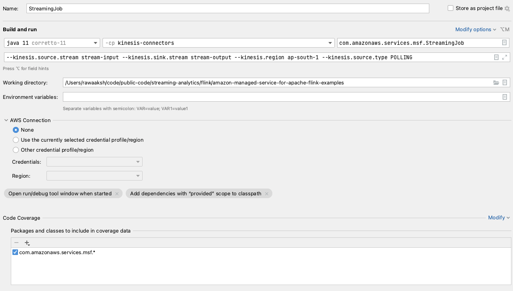

# Flink Kinesis Source & Sink examples (standard and EFO)

* Flink version: 1.15
* Flink API: DataStream API
* Language: Java (11)


This example demonstrate how to use [Flink Kinesis Connector](https://nightlies.apache.org/flink/flink-docs-release-1.15/docs/connectors/datastream/kinesis/), source and sink.

It also shows how to set up an **Enhanced Fan-Out (EFO)** source.

This example uses [`FlinkKinesisConsumer` and `KinesisStreamsSink` connectors](https://nightlies.apache.org/flink/flink-docs-release-1.15/docs/connectors/datastream/kinesis/).


### Runtime configuration

The application reads the runtime configuration from the Runtime Properties, when running on Amazon Managed Service for Apache Flink,
or from command line parameters, when running locally.

Runtime Properties are expected in the Group ID `FlinkApplicationProperties`.
Command line parameters should be prepended by `--`.

They are all case-sensitive.

Configuration parameters:

* `kinesis.source.stream` Kinesis Data Stream to be used for source (default: `source`)
* `kinesis.sink.stream` Kinesis Data Stream to be used for sink (default: `destination`)
* `kinesis.region` AWS Region where Kinesis Data Streams are (default `eu-west-1`)

#### Enhanced Fan-Out (EFO) source

To use EFO for the Kinesis Data Stream source, set up two additional configuration parameters:

* `kinesis.source.type` Kinesis Data Stream publisher type, either `POLLING` or `EFO` (default: `POLLING`)
* `kinesis.source.efoConsumer` Kinesis Data Stream EFO Consumer name; only used if `kinesis.source.type=EFO` (default: `sample-efo-flink-consumer`)

### Running locally in IntelliJ
To run this example locally -
* Create source and sink Kinesis streams. 
* Ensure that use profile is configured and user has required permission to read/write from Kinesis streams. 
* To start the Flink job in IntelliJ edit the Run/Debug configuration enabling *'Add dependencies with "provided" scope to the classpath'*.

```
--kinesis.source.stream stream-input --kinesis.sink.stream stream-output --kinesis.region ap-south-1 --kinesis.source.type POLLING
```

Following is the screenshot of run configuration


## Running locally through Maven command line
To run this example locally -
* Create source and sink Kinesis streams.
* Ensure that use profile is configured and user has required permission to read/write from Kinesis streams.
* Execute following command from the project home directory -

```
 mvn clean compile exec:java  -Dexec.classpathScope="compile" \
 -Dexec.mainClass="com.amazonaws.services.msf.StreamingJob" \
 -Dexec.args="--kinesis.source.stream stream-input --kinesis.sink.stream stream-output --kinesis.region ap-south-1 --kinesis.source.type POLLING" 

```

## Deploying using CloudFormation to Amazon Managed Service for Apache Flink
### Pre-requisite
1. Source and sink stream.
2. Create subnets and security groups for the Flink application. If you are using private subnets , ensure that VPC endpoint for Kinesis is created.
3. AWS user credential using which you can create CloudFormation stack from console or CLI.

### Build and deployment
1. The steps below create stack using `./cloudformation/msf-kinesis-stream.yaml.yaml`.
2. The script `deploy.sh` creates the stack using AWS CLI. Ensure that AWS CLI is configured and your user has permissions to create CloudFormation stack.
3. Alternatively you can deploy from console using `./cloudformation/msf-kinesis-stream.yaml` and pass required parameters.
4. Edit `deploy.sh` to modify  "Region and Network configuration" . Modify following configurations -
* region= Deployment region
* SecurityGroup= MSK Security Group.
* SubnetOne= MSK Subnet one
* SubnetTwo= MSK Subnet two
* SubnetThree= MSK Subnet three

5. Edit `deploy.sh` to modify "Kinesis configuration". Modify following configurations -
* input_stream= Input Kinesis stream name.
* output_stream= Output stream name
Ensure that source and sink streams are created. The sample assumes POLLING consumer and not EFO consumer. 

6. Build Code. Execute the script below which will build the jar and upload the jar to S3 at s3://BUCKET_NAME/flink/kinesis-connectors-1.0.jar.
```shell
./build.sh <BUCKET_NAME>
```
7. Run `deploy.sh` to deploy the CloudFormation template . Refer the sample CloudFormation template at `cloudformation/msf-kinesis-stream.yaml` .
   The CloudFormation needs the jar to be there at s3://BUCKET_NAME/flink/kinesis-connectors-1.0.jar.

```
./deploy.sh <BUCKET_NAME> 
```
8. The template creates following resources -
* Flink application with application name defined by application_name in deploy.sh.
* CloudWatch log group with name - /aws/amazon-msf/${application_name}
* CloudWatch log stream under the log group created above by name amazon-msf-log-stream.
* IAM execution role for Flink application. The role permission on MSK cluster.
* IAM managed policy.
