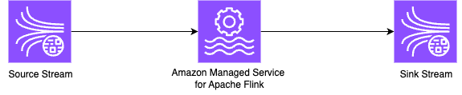

# Flink Kinesis Source & Sink examples (standard and EFO)

* Flink version: 1.20
* Flink API: DataStream API
* Language: Java (11)
* Flink connectors: Kinesis Sink

This example demonstrate how to use Flink Kinesis Connector source and sink.

It also shows how to set up an **Enhanced Fan-Out (EFO)** source.

This example uses `FlinkKinesisConsumer` and `KinesisStreamsSink` connectors.

### Runtime configuration

The application reads the runtime configuration from the Runtime Properties, when running on Amazon Managed Service for Apache Flink,
or, when running locally, from the [`resources/flink-application-properties-dev.json`](resources/flink-application-properties-dev.json) file located in the resources folder.

All parameters are case-sensitive.

| Group ID        | Key           | Description               | 
|-----------------|---------------|---------------------------|
| `InputStream0`  | `stream.arn` | ARN of the input stream.  |
| `InputStream0`  | `aws.region`  | Region of the input stream. |
| `InputStream0`  | `kinesis.stream.init.position` | (optional) Starting position when the application starts with no state. Default is `LATEST`|
| `InputStream0` | `kinesis.stream.reader.type` | (optional) Choose between standard (`POLLING`) and Enhanced Fan-Out (`EFO`) consumer. Default is `POLLING`. |
| `InputStream0` | `kinesis.stream.efo.consumer.name` | (optional, for EFO consumer mode only) Name of the EFO consumer. Only used if `kinesis.stream.reader.type=EFO`. |
| `InputStream0` | `kinesis.stream.efo.consumer.lifecycle` | (optional, for EFO consumer mode only) Lifecycle management mode of EFO consumer. Choose between `JOB_MANAGED` and `SELF_MANAGED`. Default is `JOB_MANAGED`. |
| `OutputStream0` | `stream.arn` | ARN of the output stream. |
| `OutputStream0`  | `aws.region`  | Region of the output stream. |

Every parameter in the `InputStream0` group is passed to the Kinesis consumer, and every parameter in the `OutputStream0` is passed to the Kinesis client of the sink.

See Flink Kinesis connector docs](https://nightlies.apache.org/flink/flink-docs-release-1.19/docs/connectors/datastream/kinesis/) for details about configuring the Kinesis conector.

To configure the applicaton on Managed Service for Apache Flink, set up these parameter in the *Runtime properties*.

To configure the application for running locally, edit the [json file](resources/flink-application-properties-dev.json).

### Running in IntelliJ

You can run this example directly in IntelliJ, without any local Flink cluster or local Flink installation.

See [Running examples locally](../running-examples-locally.md) for details.

### Generating data

You can use [Kinesis Data Generator](https://github.com/awslabs/amazon-kinesis-data-generator), 
also available in a [hosted version](https://awslabs.github.io/amazon-kinesis-data-generator/web/producer.html),
to generate random data to Kinesis Data Stream and test the application.
