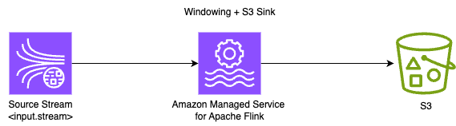

# S3 Parquet Sink

* Flink version: 1.15
* Flink API: DataStream API
* Language Java (11)

This example demonstrates how to write data coming from a Kinesis Data Stream into an Amazon S3 Bucket in Parquet format using Hive style partitioning.

This example uses data generated from the [Kinesis Data Generator](https://github.com/awslabs/amazon-kinesis-data-generator)

The Flink application consumes data in String format from a Kinesis Data Streams, 
parses the JSON and performs a count of number of symbols processed in a Tumbling Window of 1 minute, 
using processing time. It sinks the results in parquet format using Avro Writer to an S3 Bucket.



### Sample Input
```json
{"price": 36, "symbol":"AMZN"}

```
### Sample Output
The data gets written to S3 path. 
Following is the sample output of `aws s3 ls --recursive s3://<BUCKET-NAME>/flink/msf/` if the output gets written to `s3://<BUCKET-NAME>/flink/msf/` -
```shell
2023-10-13 13:36:01        736 flink/msf/year=2023/month=10/day=13/hour=13/part-06887bc3-7ba4-4c77-8688-5a673a947175-0.parquet
2023-10-13 13:39:01        747 flink/msf/year=2023/month=10/day=13/hour=13/part-34cea3b7-7f3e-4039-8ecb-3ba3ab5a5845-0.parquet
2023-10-13 13:40:01        747 flink/msf/year=2023/month=10/day=13/hour=13/part-34cea3b7-7f3e-4039-8ecb-3ba3ab5a5845-1.parquet
2023-10-13 13:41:01        747 flink/msf/year=2023/month=10/day=13/hour=13/part-34cea3b7-7f3e-4039-8ecb-3ba3ab5a5845-2.parquet
2023-10-13 13:36:01        747 flink/msf/year=2023/month=10/day=13/hour=13/part-419f4d33-0c28-40ca-936c-a34d9f6e8c8c-0.parquet
2023-10-13 13:39:01        736 flink/msf/year=2023/month=10/day=13/hour=13/part-df8700ad-679c-48f1-8bc3-7fd002efa38b-0.parquet
2023-10-13 13:40:01        736 flink/msf/year=2023/month=10/day=13/hour=13/part-df8700ad-679c-48f1-8bc3-7fd002efa38b-1.parquet
2023-10-13 13:41:01        736 flink/msf/year=2023/month=10/day=13/hour=13/part-df8700ad-679c-48f1-8bc3-7fd002efa38b-2.parquet

```

The sample content of file is -
```
{
  "symbol": "\"TBV\"",
  "count": 758
}
{
  "symbol": "\"AMZN\"",
  "count": 749
}
{
  "symbol": "\"AAPL\"",
  "count": 777
}

```

## Pre-requisites

In order for to have this sample running locally or in Amazon Managed Service For Apache Flink, you will need the following:

* Existing Kinesis Data Stream (Please add Kinesis Data Stream Name and Region in flink-application-properties-dev.json)
* Existing S3 Bucket (Please add your S3 Bucket Name, including path to which you want the application to write the results, in flink-application-properties-dev.json )
* JSON producer, for which one of the fields is "Symbol"

You can modify the Flink Application, if you wish to perform the count on a different field.

## Flink compatibility

**Note:** This project is compatible with Flink 1.15+ and Amazon Managed Service for Apache Flink.

### Flink API compatibility

It uses the `FlinkKinesisConsumer` and  `FileSink` (as opposed to `StreamingFileSink`).

## Notes about using AVRO with Apache Flink

### AVRO-generated classes

This project uses classes generated at built-time as data objects.

As a best practice, only the AVRO schema definitions (IDL `.avdl` files in this case) are included in the project source
code.

AVRO Maven plugin generates the Java classes (source code) at build-time, during the
[`generate-source`](https://maven.apache.org/guides/introduction/introduction-to-the-lifecycle.html) phase.

The generated classes are written into `./target/generated-sources/avro` directory and should **not** be committed with
the project source.

This way, the only dependency is on the schema definition file(s).
If any change is required, the schema file is modified and the AVRO classes are re-generated automatically in the build.

Code generation is supported by all common IDEs like IntelliJ.
If your IDE does not see the AVRO classes (`TradeCount`) when you import the project for the
first time, you may manually run `mvn generate-sources` once of force source code generation from the IDE.

### AVRO-generated classes (SpecificRecord) in Apache Flink

Using AVRO-generated classes (SpecificRecord) within the flow of the Flink application (between operators) or in the
Flink state, has an additional benefit.
Flink will [natively and efficiently serialize and deserialize](https://nightlies.apache.org/flink/flink-docs-master/docs/dev/datastream/fault-tolerance/serialization/types_serialization/#pojos)
these objects, without risking of falling back to Kryo.

### FileSink & S3 dependencies
The following dependencies related to AVRO and S3 are included (for FLink 1.15.4):

1. `org.apache.flink:flink-connector-files:1.15.4` - File Sink Connector
2. `org.apache.flink:flink-s3-fs-hadoop:1.15.4` - Support for writing to Amazon S3.
3. `org.apache.flink:flink-avro:1.15.4` - Support for using Avro with Flink .


### Running in Intellij

You can run this example directly in IntelliJ, without any local Flink cluster or local Flink installation.

See [Running examples locally](../running-examples-locally.md) for details.


## Deploying using CloudFormation to Amazon Managed Service for Apache Flink
### Pre-requisite
1. Kinesis stream and S3 bucket. 
2. AWS user credential using which you can create CloudFormation stack from console or CLI.

### Build and deployment
1. The steps below create stack using `./cloudformation/msf-deploy.yaml`.
2. The script `deploy.sh` creates the stack using AWS CLI. Ensure that AWS CLI is configured and your user has permissions to create CloudFormation stack.
3. Alternatively you can deploy from console using `./cloudformation/msf-deploy.yaml` and pass required parameters.
4. Edit `deploy.sh` to modify  "Region configuration" . Modify following configurations -
* region= Deployment region

5. Edit `deploy.sh` to modify "Kinesis and S3 Sink configuration". Modify following configurations -
* input_stream= Input Kinesis stream name.
* s3_bucket_name= S3 Bucket name
* s3_file_path = S3 folder path. Ex. flink/msf
  Ensure that source stream and sink bucket  are created.

6. To build code, execute the script below which will build the jar and upload the jar to S3 at s3://BUCKET_NAME/flink/flink-kds-s3.jar.
```shell
./build.sh <BUCKET_NAME>
```
7. Run `deploy.sh` to deploy the CloudFormation template . Refer the sample CloudFormation template at `./cloudformation/msf-deploy.yaml` .
   The CloudFormation needs the jar to be there at s3://BUCKET_NAME/flink/flink-kds-s3.jar.

```
./deploy.sh <BUCKET_NAME> 
```
8. The template creates following resources -
* Flink application with application name defined by application_name in deploy.sh.
* CloudWatch log group with name - /aws/amazon-msf/${application_name}
* CloudWatch log stream under the log group created above by name amazon-msf-log-stream.
* IAM execution role for Flink application. 
* IAM managed policy for permission. 


## Data generator - Kinesis
You can use [Kinesis Data Generator](https://github.com/awslabs/amazon-kinesis-data-generator),
also available in a [hosted version](https://awslabs.github.io/amazon-kinesis-data-generator/web/producer.html),
to generate random data to Kinesis Data Stream and test the application.

RecordTemplate:
```json
{
"symbol":"{{random.arrayElement(["AAPL","AMZN","MSFT","INTC","TBV"])}}"
}
```


