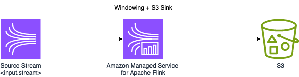
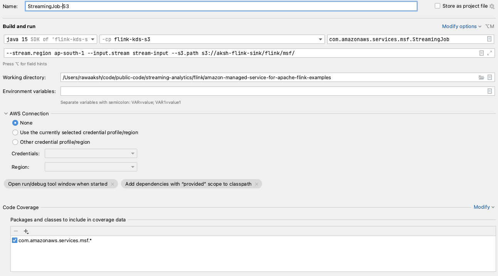

# S3 Sink

* Flink version: 1.15
* Flink API: DataStream API
* Language Java (11)

This example demonstrates how to write data coming from a Kinesis Data Stream into an Amazon S3 Bucket.

This example uses data generated from the [Kinesis Data Generator](https://github.com/awslabs/amazon-kinesis-data-generator)

The Flink application consumes data in String format from a Kinesis Data Streams, 
parses the JSON and performs a count of number of products processed in a Tumbling Window of 1 minute, 
using processing time. It sinks the results to an S3 Bucket.



### Sample Input
```json
{"price": 36, "product":"AMZN"}

```
### Sample Output
```
"AMZN" count: 2

"IBM" count: 3

"INFY" count: 2

```

## Pre-requisites

In order for to have this sample running locally or in Amazon Managed Service For Apache Flink, you will need the following:

* Existing Kinesis Data Stream (Please add Kinesis Data Stream Name and Region in flink-application-properties-dev.json)
* Existing S3 Bucket (Please add your S3 Bucket Name, including path to which you want the application to write the results, in flink-application-properties-dev.json )
* JSON producer, for which one of the fields is "product"

You can modify the Flink Application, if you wish to perform the count on a different field.

## Flink compatibility

**Note:** This project is compatible with Flink 1.15+ and Kinesis Data Analytics for Apache Flink.

### Flink API compatibility

It uses the `FlinkKinesisConsumer` and  `FileSink` (as opposed to `StreamingFileSink`).


### FileSink & S3 dependencies
The following dependencies related to FileSink Connector and Amazon S3 are included (for FLink 1.15.4):

1. `org.apache.flink:flink-connector-files:1.15.4` - File Sink Connector
2. `org.apache.flink:flink-s3-fs-hadoop:1.15.4` - Support for writing to Amazon S3.

### Running in Intellij

For running this example locally, you will need to make additional changes in the configuration. 

Steps to follow:
* Update `resources/flink-application-properties-dev.json`. Add Kinesis Data Stream Name , Stream Region and S3 path to write the data to. 
```shell
## Example
[
  {
    "PropertyGroupId": "FlinkApplicationProperties",
    "PropertyMap": {
      "input.stream": "stream-input",
      "stream.region": "ap-south-1",
      "s3.path": "s3://aksh-flink-sink/flink/msf/"
    }
  }
]
```
* Execute with AWS user that has permissions to consume data from a Kinesis Data Stream and write data into Amazon S3. 
* To start the Flink job in IntelliJ edit the Run/Debug configuration enabling 'Add dependencies with "provided" scope to
the classpath'.
* Following is the screenshot of run configuration



## Running locally through Maven command line
* Update `resources/flink-application-properties-dev.json`. Add Kinesis Data Stream Name , Stream Region and S3 path to write the data to.
* Execute with AWS user that has permissions to consume data from a Kinesis Data Stream and write data into Amazon S3.
* Execute following command from the project home directory -

```
 mvn clean compile exec:java  -Dexec.classpathScope="compile" \
 -Dexec.mainClass="com.amazonaws.services.msf.StreamingJob" 

```

## Deploying using CloudFormation to Amazon Managed Service for Apache Flink
### Pre-requisite
1. Kinesis stream and S3 bucket. 
2. Create subnets and security groups for the Flink application. If you are using private subnets , ensure that VPC endpoint for Kinesis and S3 is created.
3. AWS user credential using which you can create CloudFormation stack from console or CLI.

### Build and deployment
1. The steps below create stack using `./cloudformation/msf-deploy.yaml`.
2. The script `deploy.sh` creates the stack using AWS CLI. Ensure that AWS CLI is configured and your user has permissions to create CloudFormation stack.
3. Alternatively you can deploy from console using `./cloudformation/msf-deploy.yaml` and pass required parameters.
4. Edit `deploy.sh` to modify  "Region and Network configuration" . Modify following configurations -
* region= Deployment region
* SecurityGroup= MSK Security Group.
* SubnetOne= MSK Subnet one
* SubnetTwo= MSK Subnet two
* SubnetThree= MSK Subnet three

5. Edit `deploy.sh` to modify "Kinesis and S3 Sink configuration". Modify following configurations -
* input_stream= Input Kinesis stream name.
* s3_bucket_name= S3 Bucket name
* s3_file_path = S3 folder path. Ex. flink/msf
  Ensure that source stream and sink bucket  are created.

6. To build code, execute the script below which will build the jar and upload the jar to S3 at s3://BUCKET_NAME/flink/flink-kds-s3.jar.
```shell
./build.sh <BUCKET_NAME>
```
7. Run `deploy.sh` to deploy the CloudFormation template . Refer the sample CloudFormation template at `./cloudformation/msf-deploy.yaml` .
   The CloudFormation needs the jar to be there at s3://BUCKET_NAME/flink/flink-kds-s3.jar.

```
./deploy.sh <BUCKET_NAME> 
```
8. The template creates following resources -
* Flink application with application name defined by application_name in deploy.sh.
* CloudWatch log group with name - /aws/amazon-msf/${application_name}
* CloudWatch log stream under the log group created above by name amazon-msf-log-stream.
* IAM execution role for Flink application. 
* IAM managed policy for permission. 


## Data generator - Kinesis
You can use [Kinesis Data Generator](https://github.com/awslabs/amazon-kinesis-data-generator),
also available in a [hosted version](https://awslabs.github.io/amazon-kinesis-data-generator/web/producer.html),
to generate random data to Kinesis Data Stream and test the application.

RecordTemplate:
```json
{
"price": {{random.number.float({"min":1,"max":99,"precision": 0.01})}}, 
"product":"{{random.arrayElement(["AAPL","AMZN","MSFT","INTC","TBV"])}}"
}
```


