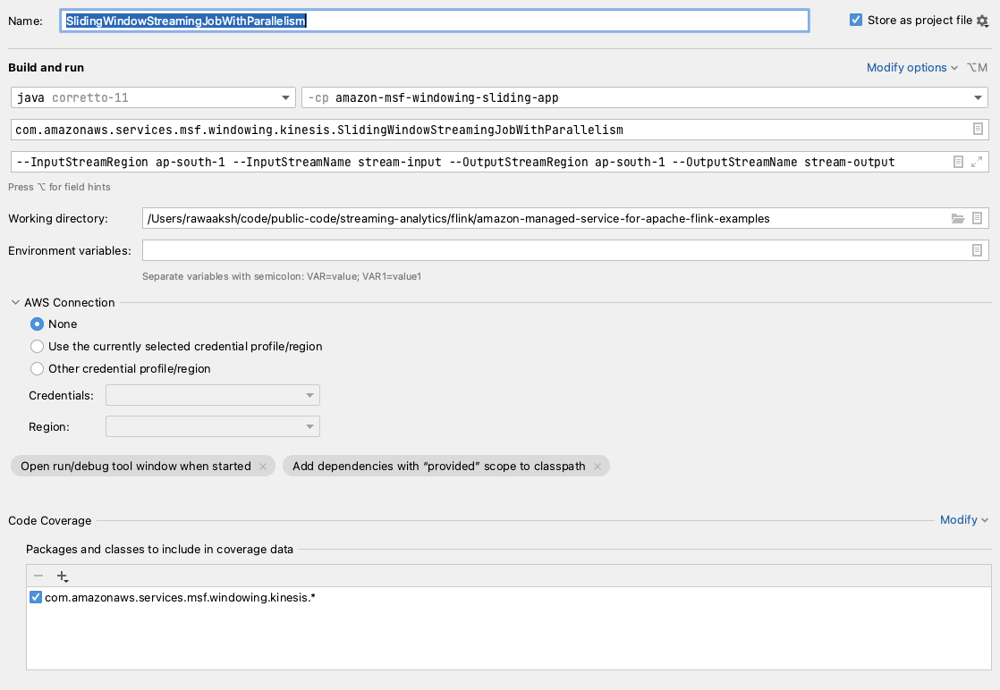

# Getting Started Flink Java project - Sliding Window

Example of project for a basic Flink Java application using a sliding window.

* Flink version: 1.18
* Flink API: DataStream API
* Flink Connectors: Kinesis Connector
* Language: Java (11)

The project can run both on Amazon Managed Service for Apache Flink, and locally for development.
There is one sample application which shows sliding windowing example.

### Kinesis - Sliding window
`com.amazonaws.services.msf.windowing.kinesis.SlidingWindowStreamingJobWithParallelism`


The application reads from a Kinesis source stream and writes to Kinesis destination stream,
showing how to implement a simple minimum price calculation for each stock using sliding window assigner.

### Sample Input
```json
{"price": 10.0, "ticker":"AMZN"}
```
### Sample Output
```
"AMZN",12.80
```

## Runtime configuration

The application reads the runtime configuration from the Runtime Properties, when running on Amazon Managed Service for
Apache Flink, or from command line parameters, when running locally.

Runtime Properties are expected in the Group ID `FlinkApplicationProperties`.
Command line parameters should be prepended by `--`.

They are all case-sensitive.

Configuration parameters:

* `InputStreamRegion` region of the input stream (default: `us-east-1`)
* `InputStreamName` name of the input Kinesis Data Stream (default: `ExampleInputStream`)
* `OutputStreamRegion` region of the input stream (default: `us-east-1`)
* `OutputStreamName` name of the input Kinesis Data Stream (default: `ExampleOutputStream`)

## Running in IntelliJ
To run this example locally:
* Create source and sink Kinesis streams.
* Ensure that use profile is configured and user has required permission to read/write from Kinesis streams. 
* To start the Flink job in IntelliJ edit the Run/Debug configuration enabling *'Add dependencies with "provided" scope to
the classpath'*.

```
--InputStreamRegion ap-south-1 --InputStreamName stream-input --OutputStreamRegion ap-south-1 --OutputStreamName stream-windowing-output
```

Following is the screenshot of run configuration


## Data generator - Kinesis
You can use [Kinesis Data Generator](https://github.com/awslabs/amazon-kinesis-data-generator),
also available in a [hosted version](https://awslabs.github.io/amazon-kinesis-data-generator/web/producer.html),
to generate random data to Kinesis Data Stream and test the application.

RecordTemplate:

`{"price": {{random.number.float({
"min":1,
"max":99,
"precision": 0.01
})}}, "ticker":"{{random.arrayElement(
["AAPL","AMZN","MSFT","INTC","TBV"]
)}}"}`

