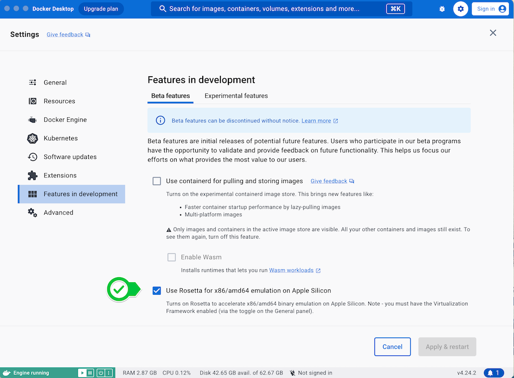
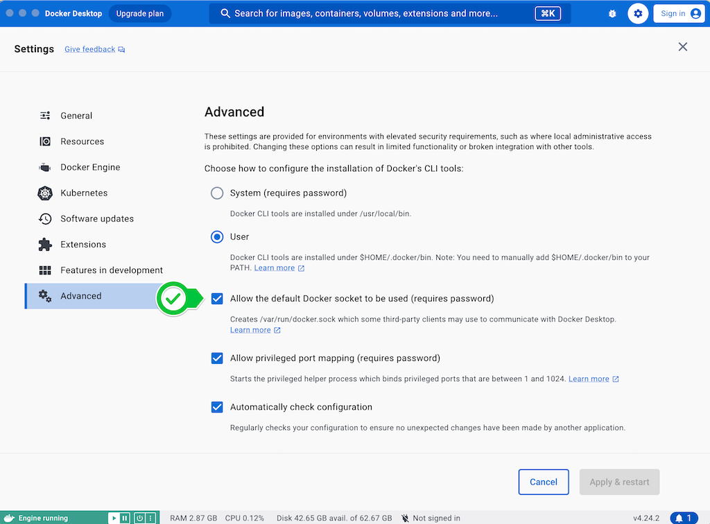
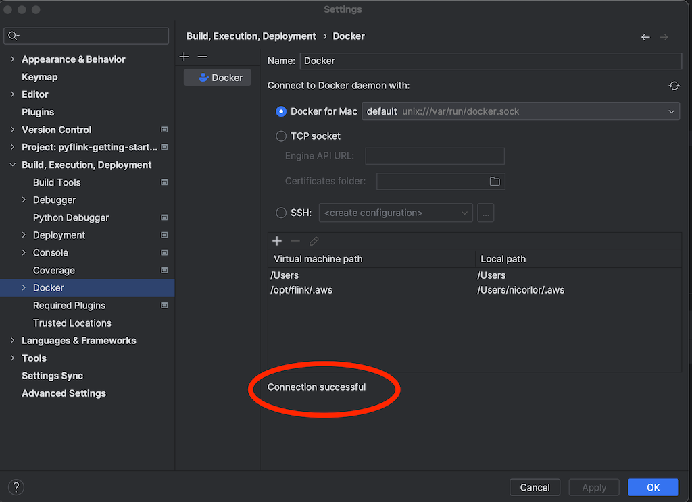
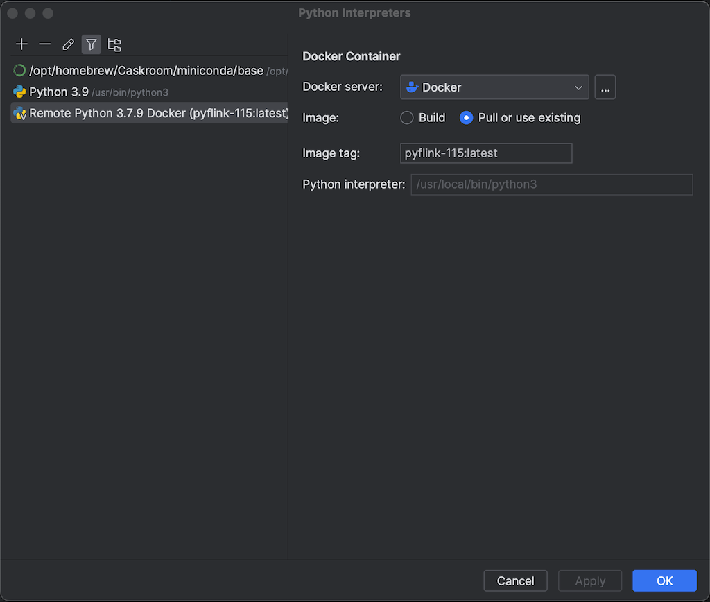
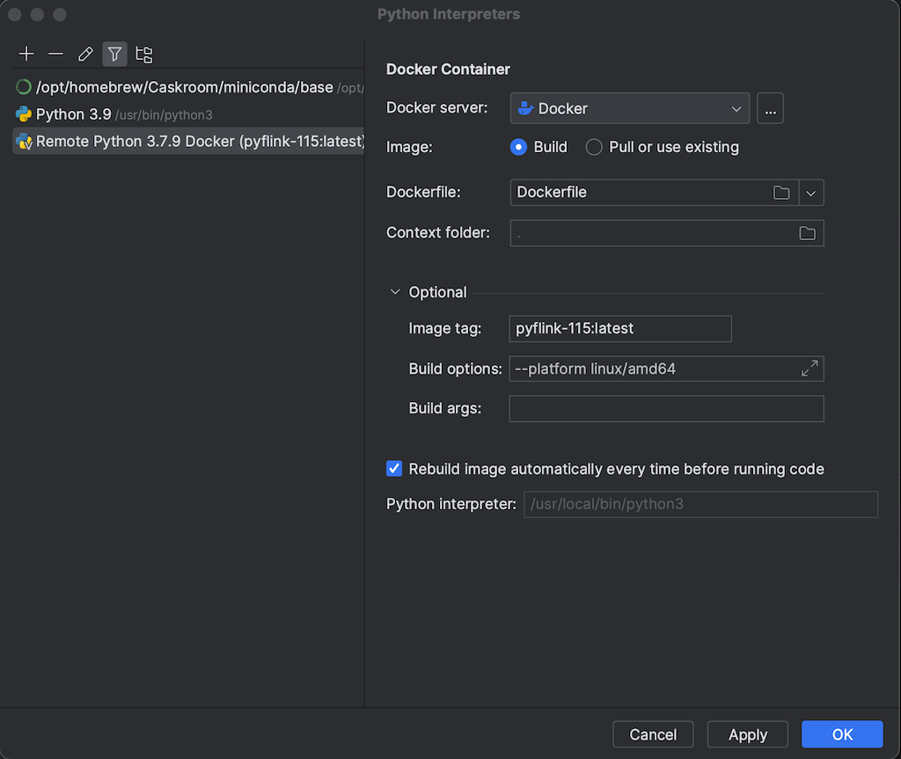
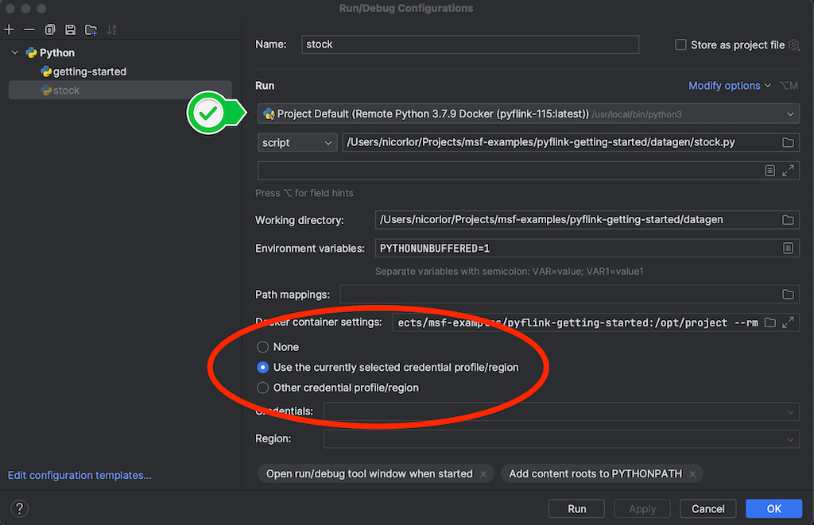

# PyFlink 1.15 development on Apple Silicon Mac

> 🚨 This limitation only applies to Flink 1.15, and only for local development on Apple Silicon macOS machines.
> If you are using Flink 1.18 or later, you can install PyFlink libraries on your macOS machine as any other Python library. 
> See the [Getting Started](../GettingStarted) for more details.


### Problem

There are known issues with installing PyFlink dependencies on Mac using Apple Silicon chips (see [FLINK-26981](https://issues.apache.org/jira/browse/FLINK-26981)). These issues, resolved in Flink 1.16.x, make it difficult to develop PyFlink 1.15.x applications on new Mac machines, using IDE like PyCharm or Visual Studio Code.

### Solution overview

Use a Docker image built for Intel architecture (`amd64`) with all required Python dependencies.
Enable Rosetta emulation in Docker, to run on Apple Silicon Mac images for Intel architecture.
Leverage the ability of advanced IDE to run the Python interpreter inside a Docker container.

## Step-by-step instructions

### Requirements

* An IDE supporting the execution of Python interpreter inside a Docker container:
    * [PyCharm Professional](https://www.jetbrains.com/help/pycharm/using-docker-as-a-remote-interpreter.html) (Community Edition does not support this, directly)
    * [Visual Studio Code](https://code.visualstudio.com/docs/devcontainers/containers)
* Docker running on the Mac machine; the instructions will refer to Docker Desktop
* Install IDE plugins to integrate with Docker and AWS
    * [PyCharm Docker Plugin](https://www.jetbrains.com/help/pycharm/docker.html)
    * [AWS Toolkit for PyCharm](https://aws.amazon.com/pycharm/)
    * [AWS Toolkit for Visual Studio Code](https://aws.amazon.com/visualstudiocode/)

### Docker configuration

1. **Enable Rosetta emulation**
   
    In Docker Desktop: _Settings_ > _Feature in development_ > _Beta features_ > _Use Rosetta for x86/amd64 emulation on Apple Silicon_: enable

    

2. **Enable Docker socket**, required for IDE integration

    In Docker Desktop: _Settings_ > _Advanced_ > _Allow the default docker socket to be used_ : enable

    

### Dockerfile

The provided [Dockerfile](./Dockerfile) is based on what recommended in [Flink 1.15 documentation](https://nightlies.apache.org/flink/flink-docs-release-1.15/docs/deployment/resource-providers/standalone/docker/#using-flink-python-on-docker). 

We install Python 3.8, boto3, that is often required if you connect to AWS API directly, and AWS CLI for troubleshooting.

```dockerfile
FROM flink:1.15.4

ARG PYTHON_VERSION=3.8.9

RUN apt-get update -y && \
apt-get install -y build-essential libssl-dev zlib1g-dev libbz2-dev libffi-dev && \
wget https://www.python.org/ftp/python/${PYTHON_VERSION}/Python-${PYTHON_VERSION}.tgz && \
tar -xvf Python-${PYTHON_VERSION}.tgz && \
cd Python-${PYTHON_VERSION} && \
./configure --without-tests --enable-shared && \
make -j6 && \
make install && \
ldconfig /usr/local/lib && \
cd .. && rm -f Python-${PYTHON_VERSION}.tgz && rm -rf Python-${PYTHON_VERSION} && \
ln -s /usr/local/bin/python3 /usr/local/bin/python && \
apt-get clean && \
rm -rf /var/lib/apt/lists/*

RUN pip3 install apache-flink==1.15.4 boto3 awscli
```

The docker image must be built for the `linux/amd64` platform not to face the Python dependency issues.

There are two options:

* a) Build the image manually and instruct the IDE to use the specific image. In this case the image can be pulled from an Image Repository.
* b) Provide the Dockerfile to the IDE and instruct the IDE to build the image for `linux/amd64`.

For option (b) you need to copy the `Dockerfile` in your project folder and skip the next step.

### Build the Docker image for "Intel" architecture

This step is required for option (a), to build the docker image.

From the directory containing the Dockerfile, run the following command:

```shell
docker build --platform linux/amd64 --tag pyflink-115:latest .
```

This can take a few minutes and will create an image, named pyflink-115 (you can choose a different name).

### PyCharm: Configure to run the Python interpreter in Docker

1. Create Docker execution environment
  
    _Settings_ > _Build, Execution, Deployment > Docker_
    
    * Add new Docker environment
        * Select *Docker for Mac*
        * Verify  “connection successful” is reported at the bottom of the window,
          If it cannot connect, verify you have enabled the default docker socket and restarted docker daemon
        * 

2. Set the interpreter for the project
  
    _Project Settings_ > _Python Interpreter_ : _Add Interpreter_ : _On Docker_

    * Select: _Existing Docker environment_
    * Image - depending on the option you chose, above
       * a) _Pull or use existing_
         * type the name of the image (`pyflink-115:latest`)
         * 
       * b) _Build_
         * _Dockerfile_: select the dockerfile you previously copied in the project folder
         * _Image tag_: `pyflink-115:latest` (you can choose a different tag)
         * _Build options_: `--platform linux/amd64`
         * Uncheck _Rebuild image automatically every time before running code_ (the image takes a few minutes to build and there is no reason of rebuilding on every run, unless you modify the Dockerfile) 
         * 
    * *Next* (Pull Docker Image or Build Image)
    * *Next* (Project directory and language runtime configuration)
      * Select: _System Interpreter_ (`/usr/local/bion/python3`)
    * *Create*

### Configure AWS Toolkit plugin to provide the AWS credential to the running application

Configure the AWS Toolkit to get a valid AWS authentication with access to all resources the Flink application must access (e.g. Kinesis Data Streams, S3 buckets...)
The configuration depends on the way you provide the credentials (refer to the [AWS Toolkit documentation](https://docs.aws.amazon.com/toolkit-for-jetbrains/latest/userguide/welcome.html)).

Also configure the script Run Configuration accordingly, e.g. to _“Use the currently selected credential profile/region”_.




### Configuring Visual Studio Code

Refer to Visual Studio Code documentation to [develop with Python inside a container](https://code.visualstudio.com/docs/devcontainers/containers).

Refer to [AWS Toolkit documentation](https://docs.aws.amazon.com/toolkit-for-jetbrains/latest/userguide/welcome.html) to pass the AWS authentication to the PyFlink application.

## Additional notes

While experimenting with the docker image, you may end up with many dangling images. As each PyFlink image is 2.1 GB you may quickly run out of space.
Periodically check the images 

```shell
docker image ls --all
```

...and prune all dangling ones

```shell
docker image prune
```

### Conclusions

Following these steps you can set up a local development environment for PyFlink 1.15 on Mac using Apple Silicon Chips and use IDE like PyCharm or Visual Studio Code to run and debug the application on your Mac development machine.

No change to the application is required.

These steps will not affect the way you package your application for the environment where you deploy your application, whether it is a self-managed Apache Flink cluster or [Amazon Managed Service for Apache Flink](https://aws.amazon.com/managed-service-apache-flink/).
